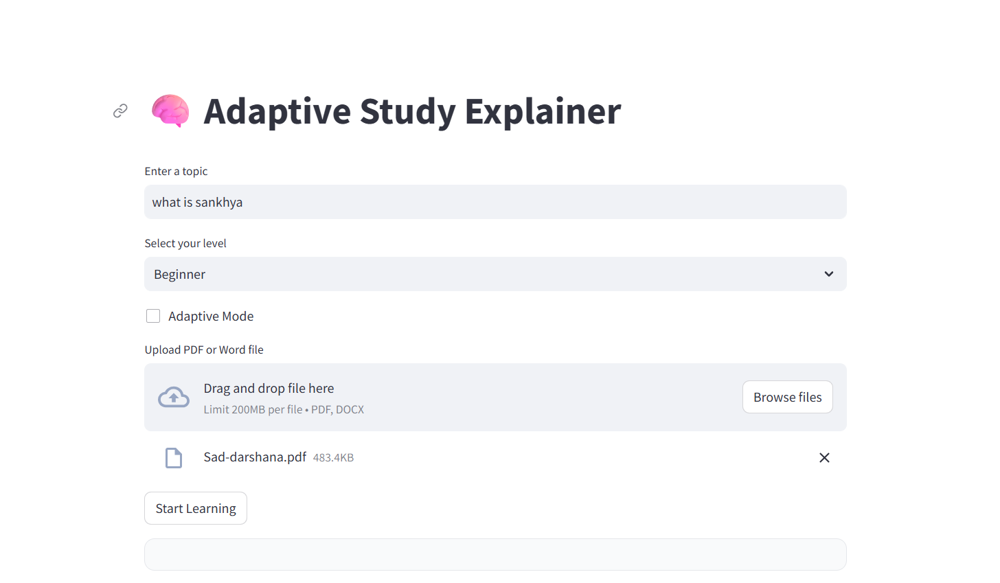
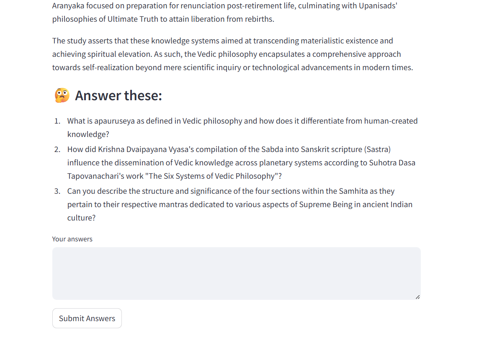
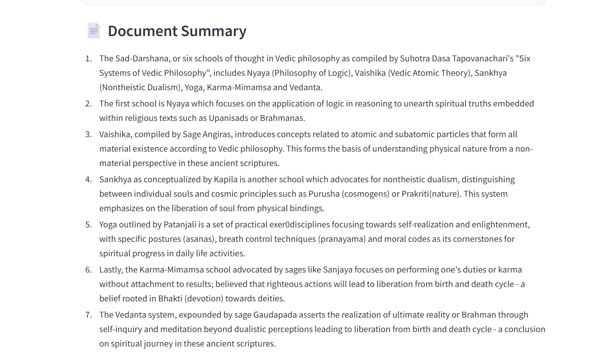
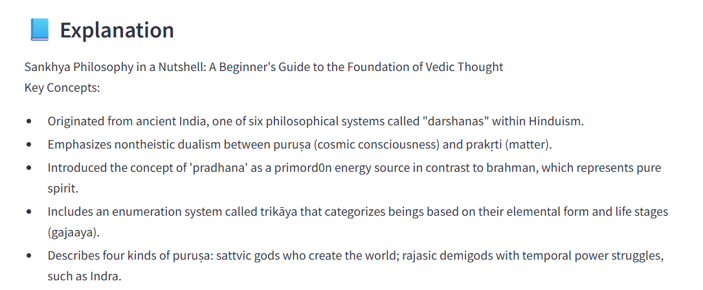
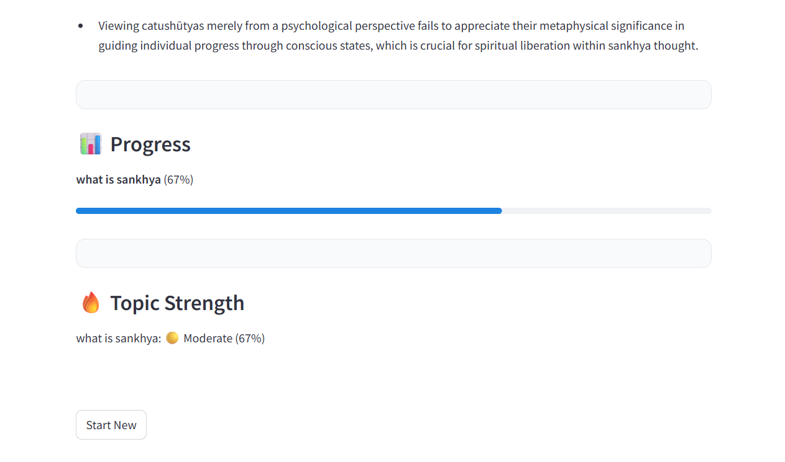
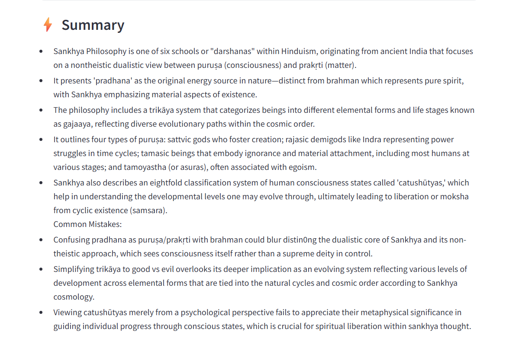

# 🧠 Adaptive Study Explainer

An AI-powered local learning assistant that explains topics based on user understanding and uploaded documents.

Built with a lightweight architecture for fast, offline performance (no vector databases or embeddings).

---

## 📸 Screenshots

<p align="center">
  
</p>

<p align="center">
  
</p>

<p align="center">
  
</p>

<p align="center">
  
</p>
<p align="center">
  
</p>
<p align="center">
  
</p>
---

## 🚀 Features

### 📂 Document Understanding
- Upload PDF or Word documents
- Extracts and analyzes content locally
- Generates concise summaries (100–200 words)

### 🤔 Adaptive Learning Mode
- AI asks targeted questions before teaching
- Understands user knowledge level and gaps
- Adjusts explanation accordingly

### 📘 Personalized Explanations
- Tailored based on:
  - User level (Beginner / Intermediate / Advanced)
  - User answers
  - Document context

### ⚡ Smart Summarization
- Generates short summaries for quick revision

### 🧠 Lightweight Memory
- Tracks weak topics based on user responses
- Uses simple JSON storage (no embeddings)

---

## 🛠️ Tech Stack

- Python  
- Streamlit  
- Ollama (phi3)  
- PyPDF2  
- python-docx  

---

## ⚙️ How It Works

1. Enter a topic or upload a document  
2. AI optionally asks diagnostic questions  
3. User answers are analyzed  
4. AI generates:
   - Explanation  
   - Summary  
5. Weak topics are stored for adaptation  

---

## ▶️ Run Locally

```bash
pip install -r requirements.txt
ollama run phi3
streamlit run app.py
